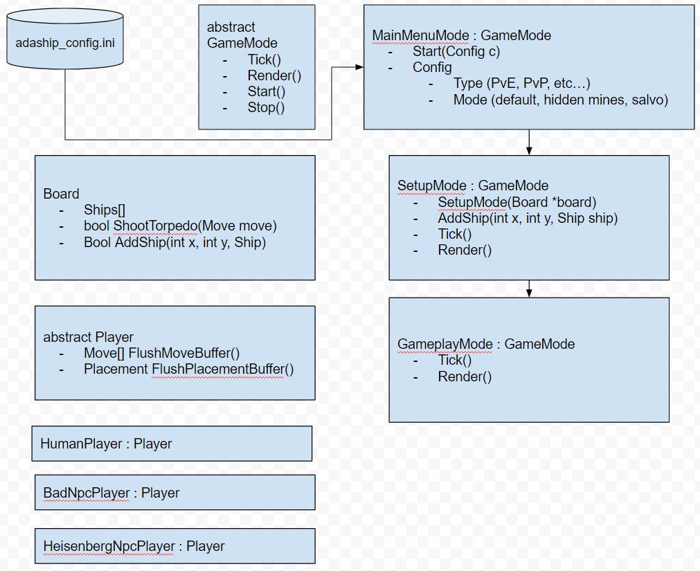
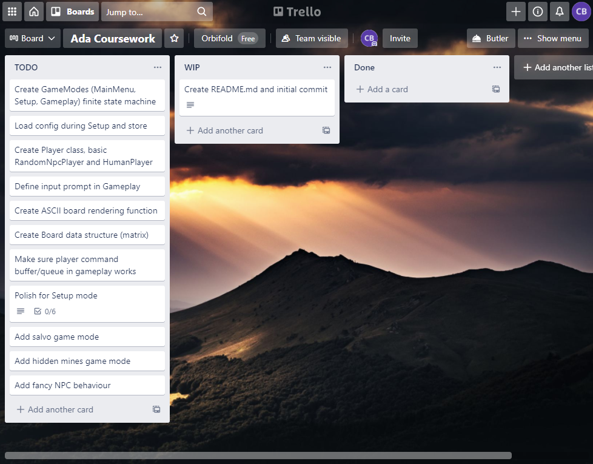

# AdaShip

## 1. Challenge Outline

The defined problem statement is AdaShip, a video game based on the real-world
game, Battleships.

### UML diagram

### Project management

I have decomposed this project into multiple key tasks, and plotted them on a
Kanban board (Trello).

View online: https://trello.com/b/TUlLQm1p/ada-coursework.

## 2. Development

* I've used multiple design patterns in my work, which create a better overall
  structure for the program.
* This includes: bitwise manipulation, finite state automata (`GameMode`), and super
  basic artificial intelligence.
* Regular code check-ins and self-review can be seen by observing the `git log`
  command's output.
* Manual testing has been used, but automated tests are difficult to implement with
  Repl.It, so I didn't use those. In future, this would be a better path, though
  tests are admittedly not used very often in the game development world outside of
  core engine tech.
* I've used my Trello board to observe, document and triage bugs/tasks.

## 3. Evaluation
* I've tried to use pointers so that I can pass around references to objects
  without having to move them around in memory. This allows the various game modes to access and mutate the `Players` and `Boards` as they flow through the various systems.
* I've tried to stick to the Google C++ Style Guide (https://google.github.io/styleguide/cppguide.html) when writing my code. This keeps things consistent, maintainable and an easy reference to point towards when making decisions about coding trade-offs. One example is putting everything into a namespace. If I was to extend the program, I would be able to be confident that linking with another library (either staticly or dynamically) would not cause any symbol conflicts. A similar pattern can be seen with the header guards, which help prevent symbol conflicts and even cyclic dependencies. This is better than `#pragma once` as it is cross platform.
* The entire game logic from start to finish is built as one finite state machine. This gives me an easy structure to build into, and makes a natural point if I wanted to extend the game in future. For example, creating a `SettingsMenu`.
* My favourite programming pattern is the abstractions used on the `Player` object, and the subclasses such as `HumanPlayer` and `BadNpcPlayer`. This allows my game logic to treat all types of players with the same interface. I can even have multiple NPC implementations, such as what I've done with the `SmartNpcPlayer` that implements a fancier targeting logic. Even when placing down objects or making targeting moves, all types of players simply act as command buffers for their controller.
* For the `SmartNpcPlayer` implementation, I've gone with a slightly more upgraded version of random search. Firstly, we use a random scattering for "searching" for targets, but when a hit is detected, we bias the targeting to hit much closer to where we did last time. That spreads out slowly until we're doing a random search again. This algorithm was of my own design (although you might find examples of it in the wild) as it was conceptually simple, worked well with the subroutines I'd already implemented, but provided enough 'edge' to make this a superior opponent.
* The worst part of my design is probably how I've handled the auto placement. Originally, I had designed my NPC player to return randomly placed objects, however, I ended up implementing `Board::AutoPlace`, as the human player needed access to this functionality too.